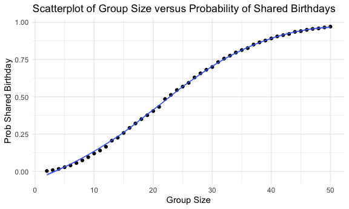
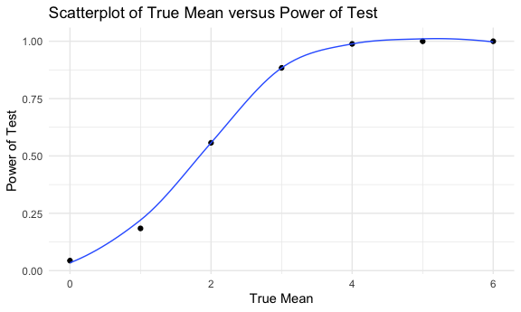
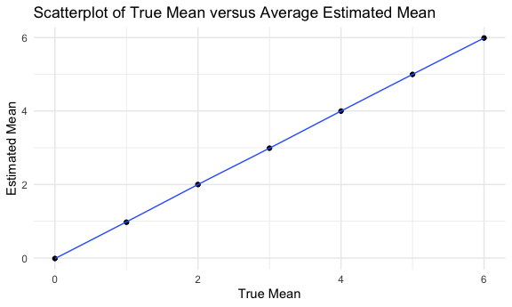
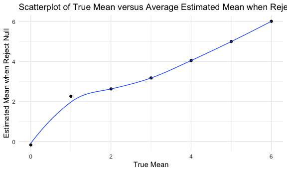
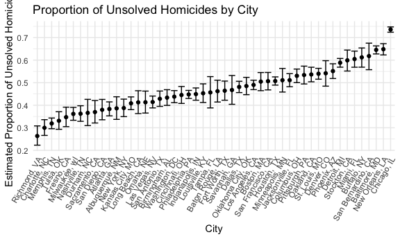

p8105_hw5_lr3257
================
Leonor Rui
2024-11-10

## Problem 1

``` r
bday_sim = function(n){
  bdays = sample(1:365, size = n, replace = TRUE)
  
  duplicate = length(unique(bdays)) < n 
  
  return(duplicate)
}
```

``` r
prob_shared = c()

for (n in 2:50){
  
  num_shared = 0
  
  for (i in 1:10000){
    
    if (bday_sim(n) == TRUE){
      
      num_shared = num_shared + 1
      
    }
  }
  prob_shared = c(prob_shared, num_shared/10000)
}
```

``` r
samp_size = 2:50
bday_df = data.frame(samp_size, prob_shared)

bday_df |>
  ggplot(aes(x = samp_size, y = prob_shared)) +
  geom_point() + 
  geom_smooth(size = 0.5) +
  labs(
    title = "Scatterplot of Group Size versus Probability of Shared Birthdays",
    x = "Group Size", 
    y = "Prob Shared Birthday"
  )
```

    ## `geom_smooth()` using method = 'loess' and formula = 'y ~ x'



As the graph shows, initially, the probability of having at least two
people sharing the same birthday increases sharply as the group size
increases until it hits 50%. After this, the growth slows down as it
approaches 100% but does not fully reach it.

## Problem 2

``` r
n = 30
sigma = 5
prob_rejected = c()
ave_estimate = c()
ave_estimate_rejected = c()

for (mu in 0:6){
  
  num_rejected = 0
  sum_estimate = 0
  sum_estimate_rejected = 0
  
  for (j in 1:5000){
    
    normal_df = rnorm(n, mu, sigma)
    
    results = t.test(normal_df)|>
      broom::tidy()
    
    estimate = results[["estimate"]]
    p_value = results[["p.value"]]
    sum_estimate = sum_estimate + estimate
    
    if(p_value < 0.05){
      num_rejected = num_rejected + 1
      sum_estimate_rejected = sum_estimate_rejected + estimate
    }
  }
  prob_rejected = c(prob_rejected, num_rejected/5000)
  
  ave_estimate = c(ave_estimate, sum_estimate/5000)
  
  ave_estimate_rejected = c(ave_estimate_rejected, sum_estimate_rejected/num_rejected)
}
```

``` r
tru_mu = 0:6

norm_df = data.frame(tru_mu, prob_rejected)

norm_df |>
  ggplot(aes(x = tru_mu, y = prob_rejected)) +
  geom_point() + 
  geom_smooth(size = 0.5, se = FALSE) +
  labs(
    title = "Scatterplot of True Mean versus Power of Test",
    x = "True Mean", 
    y = "Power of Test"
  )
```

    ## `geom_smooth()` using method = 'loess' and formula = 'y ~ x'



The plot shows that as the true mean increases, the power of the test
also increases, with a trend of increasing sharply first and slows down
as the true mean becomes substantially large. This shows that a larger
effect size (true mean being further away from the hypothesized mean)
makes it easier to reject the null hypothesis, which increases the power
of the test.

``` r
norm_df2 = data.frame(tru_mu, ave_estimate)

norm_df2 |>
  ggplot(aes(x = tru_mu, y = ave_estimate)) +
  geom_point() + 
  geom_smooth(size = 0.5, se = FALSE) +
  labs(
    title = "Scatterplot of True Mean versus Average Estimated Mean",
    x = "True Mean", 
    y = "Estimated Mean"
  )
```

    ## `geom_smooth()` using method = 'loess' and formula = 'y ~ x'



``` r
norm_df3 = data.frame(tru_mu, ave_estimate_rejected)

norm_df3 |>
  ggplot(aes(x = tru_mu, y = ave_estimate_rejected)) +
  geom_point() + 
  geom_smooth(size = 0.5, se = FALSE) +
  labs(
    title = "Scatterplot of True Mean versus Average Estimated Mean when Reject Null",
    x = "True Mean", 
    y = "Estimated Mean when Reject Null"
  )
```

    ## `geom_smooth()` using method = 'loess' and formula = 'y ~ x'



The average estimate of mean when the null is rejected is close to the
true mean, but not as close as the overall average estimate of mean. In
fact, the line of the average estimated mean of rejected null is
slightly higher at each point than the line of the overall average
estimated mean. This may be due to the exclusion of fail to reject nulls
(with small mean equals to 0) lead the sample means to be more extreme,
making the estimated means larger than the true means.

## Problem 3

Import dataset

``` r
homicide_df = read.csv("data/homicide-data.csv")
```

- Describe the raw data. Create a city_state variable (e.g. “Baltimore,
  MD”) and then summarize within cities to obtain the total number of
  homicides and the number of unsolved homicides (those for which the
  disposition is “Closed without arrest” or “Open/No arrest”).

The dataset has 52179 observations and 12 variables. Important variables
include reported_date, victim age, sex, and race, city, state, and
disposition.

``` r
homicide_df = homicide_df |>
  mutate(
    city_state = paste(city, state, sep = ", "))

homicide_df |>
  group_by(city_state) |>
  summarise(
    total_homicides = n(),
    unsolved_homicides = sum(disposition %in% c("Closed without arrest", "Open/No arrest"))
  )
```

    ## # A tibble: 51 × 3
    ##    city_state      total_homicides unsolved_homicides
    ##    <chr>                     <int>              <int>
    ##  1 Albuquerque, NM             378                146
    ##  2 Atlanta, GA                 973                373
    ##  3 Baltimore, MD              2827               1825
    ##  4 Baton Rouge, LA             424                196
    ##  5 Birmingham, AL              800                347
    ##  6 Boston, MA                  614                310
    ##  7 Buffalo, NY                 521                319
    ##  8 Charlotte, NC               687                206
    ##  9 Chicago, IL                5535               4073
    ## 10 Cincinnati, OH              694                309
    ## # ℹ 41 more rows

- For the city of Baltimore, MD, use the prop.test function to estimate
  the proportion of homicides that are unsolved; save the output of
  prop.test as an R object, apply the broom::tidy to this object and
  pull the estimated proportion and confidence intervals from the
  resulting tidy dataframe.

``` r
baltimore_df = homicide_df |>
  filter(city_state == "Baltimore, MD")

baltimore_total = nrow(baltimore_df)
baltimore_unsolved = sum(baltimore_df$disposition %in% c("Closed without arrest", "Open/No arrest"))

baltimore_prop = prop.test(baltimore_unsolved, baltimore_total)

baltimore_prop |>
  broom::tidy() |>
  select(estimate, conf.low, conf.high)
```

    ## # A tibble: 1 × 3
    ##   estimate conf.low conf.high
    ##      <dbl>    <dbl>     <dbl>
    ## 1    0.646    0.628     0.663

- Now run prop.test for each of the cities in your dataset, and extract
  both the proportion of unsolved homicides and the confidence interval
  for each. Do this within a “tidy” pipeline, making use of purrr::map,
  purrr::map2, list columns and unnest as necessary to create a tidy
  dataframe with estimated proportions and CIs for each city.

``` r
city_prop = function(city){
  
  city_df = homicide_df |>
    filter(city_state == !!city)
  
  city_total = nrow(city_df)
  city_unsolved = sum(city_df$disposition %in% c("Closed without arrest", "Open/No arrest"))
  
  city_prop_test = prop.test(city_unsolved, city_total)
  
  city_results = city_prop_test |>
    broom::tidy() |>
    select(estimate, conf.low, conf.high)
  
  return(city_results)
  
}
```

``` r
city_prop_df = 
  tibble(
    distinct(homicide_df, city_state)
  ) |>
  mutate(results = map(city_state, city_prop)) |>
  unnest(results)

city_prop_df
```

    ## # A tibble: 51 × 4
    ##    city_state      estimate conf.low conf.high
    ##    <chr>              <dbl>    <dbl>     <dbl>
    ##  1 Albuquerque, NM    0.386    0.337     0.438
    ##  2 Atlanta, GA        0.383    0.353     0.415
    ##  3 Baltimore, MD      0.646    0.628     0.663
    ##  4 Baton Rouge, LA    0.462    0.414     0.511
    ##  5 Birmingham, AL     0.434    0.399     0.469
    ##  6 Boston, MA         0.505    0.465     0.545
    ##  7 Buffalo, NY        0.612    0.569     0.654
    ##  8 Charlotte, NC      0.300    0.266     0.336
    ##  9 Chicago, IL        0.736    0.724     0.747
    ## 10 Cincinnati, OH     0.445    0.408     0.483
    ## # ℹ 41 more rows

- Create a plot that shows the estimates and CIs for each city – check
  out geom_errorbar for a way to add error bars based on the upper and
  lower limits. Organize cities according to the proportion of unsolved
  homicides.

``` r
city_prop_df |>
  filter(estimate != 0) |>
  ggplot(aes(x = reorder(city_state, estimate), y = estimate)) +
  geom_point() +
  geom_errorbar(aes(ymin = conf.low, ymax = conf.high)) +
  theme(axis.text.x = element_text(angle = 60, vjust = 1, hjust = 1)) +
  labs(
    title = "Proportion of Unsolved Homicides by City", 
    x = "City", y = "Estimated Proportion of Unsolved Homicides"
  )
```


