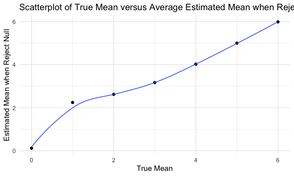

p8105_hw5_lr3257
================
Leonor Rui
2024-11-10

## Problem 1

``` r
bday_sim = function(n){
  bdays = sample(1:365, size = n, replace = TRUE)
  
  duplicate = length(unique(bdays)) < n 
  
  return(duplicate)
}
```

``` r
prob_shared = c()

for (n in 2:50){
  
  num_shared = 0
  
  for (i in 1:10000){
    
    if (bday_sim(n) == TRUE){
      
      num_shared = num_shared + 1
      
    }
  }
  prob_shared = c(prob_shared, num_shared/10000)
}
```

``` r
samp_size = 2:50
bday_df = data.frame(samp_size, prob_shared)

bday_df |>
  ggplot(aes(x = samp_size, y = prob_shared)) +
  geom_point() + 
  geom_smooth(size = 0.5) +
  labs(
    title = "Scatterplot of Group Size versus Probability of Shared Birthdays",
    x = "Group Size", 
    y = "Prob Shared Birthday"
  )
```

    ## `geom_smooth()` using method = 'loess' and formula = 'y ~ x'


As the graph shows, initially, the probability of having at least two
people sharing the same birthday increases sharply as the group size
increases until it hits 50%. After this, the growth slows down as it
approaches 100% but does not fully reach it.

## Problem 2

``` r
n = 30
sigma = 5
prob_rejected = c()
ave_estimate = c()
ave_estimate_rejected = c()

for (mu in 0:6){
  
  num_rejected = 0
  sum_estimate = 0
  sum_estimate_rejected = 0
  
  for (j in 1:5000){
    
    normal_df = rnorm(n, mu, sigma)
    
    results = t.test(normal_df)|>
      broom::tidy()
    
    estimate = results[["estimate"]]
    p_value = results[["p.value"]]
    sum_estimate = sum_estimate + estimate
    
    if(p_value < 0.05){
      num_rejected = num_rejected + 1
      sum_estimate_rejected = sum_estimate_rejected + estimate
    }
  }
  prob_rejected = c(prob_rejected, num_rejected/5000)
  
  ave_estimate = c(ave_estimate, sum_estimate/5000)
  
  ave_estimate_rejected = c(ave_estimate_rejected, sum_estimate_rejected/num_rejected)
}
```

``` r
tru_mu = 0:6

norm_df = data.frame(tru_mu, prob_rejected)

norm_df |>
  ggplot(aes(x = tru_mu, y = prob_rejected)) +
  geom_point() + 
  geom_smooth(size = 0.5, se = FALSE) +
  labs(
    title = "Scatterplot of True Mean versus Power of Test",
    x = "True Mean", 
    y = "Power of Test"
  )
```

    ## `geom_smooth()` using method = 'loess' and formula = 'y ~ x'


The plot shows that as the true mean increases, the power of the test
also increases, with a trend of increasing sharply first and slows down
as the true mean becomes substantially large. This shows that a larger
effect size (true mean being further away from the hypothesized mean)
makes it easier to reject the null hypothesis, which increases the power
of the test.

``` r
norm_df2 = data.frame(tru_mu, ave_estimate)

norm_df2 |>
  ggplot(aes(x = tru_mu, y = ave_estimate)) +
  geom_point() + 
  geom_smooth(size = 0.5, se = FALSE) +
  labs(
    title = "Scatterplot of True Mean versus Average Estimated Mean",
    x = "True Mean", 
    y = "Estimated Mean"
  )
```

    ## `geom_smooth()` using method = 'loess' and formula = 'y ~ x'


``` r
norm_df3 = data.frame(tru_mu, ave_estimate_rejected)

norm_df3 |>
  ggplot(aes(x = tru_mu, y = ave_estimate_rejected)) +
  geom_point() + 
  geom_smooth(size = 0.5, se = FALSE) +
  labs(
    title = "Scatterplot of True Mean versus Average Estimated Mean when Reject Null",
    x = "True Mean", 
    y = "Estimated Mean when Reject Null"
  )
```

    ## `geom_smooth()` using method = 'loess' and formula = 'y ~ x'



The average estimate of mean when the null is rejected is close to the
true mean, but not as close as the overall average estimate of mean. In
fact, the line of the average estimated mean of rejected null is
slightly higher at each point than the line of the overall average
estimated mean. This may be due to the exclusion of fail to reject nulls
(with small mean equals to 0) lead the sample means to be more extreme,
making the estimated means larger than the true means.
